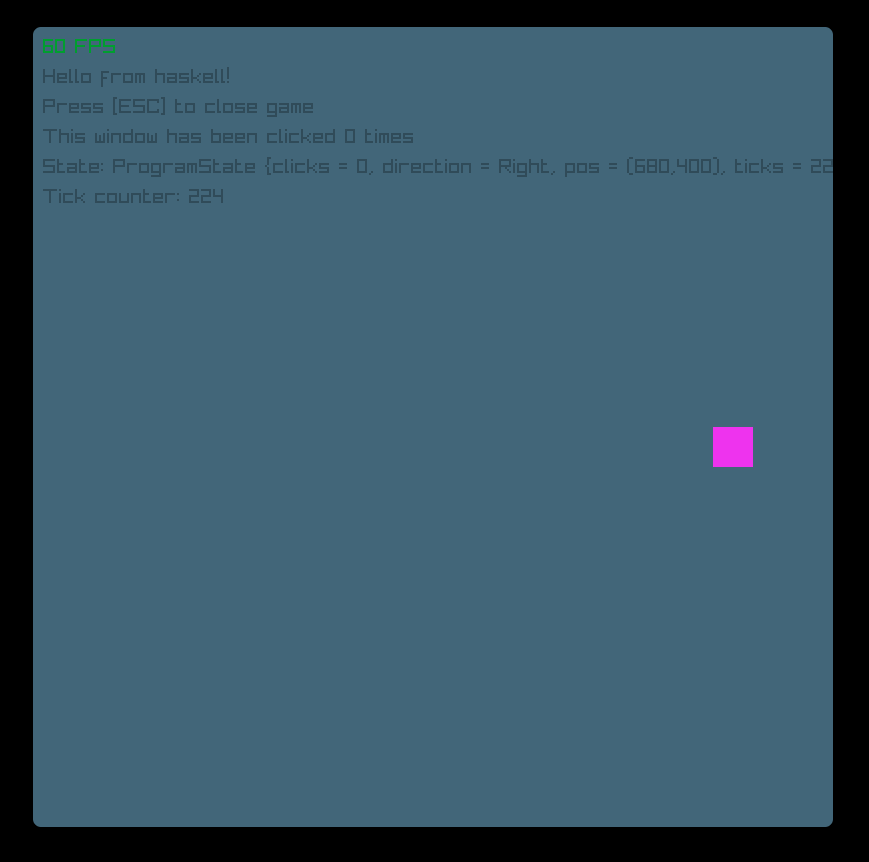

# ghc-web-test

This is an example project that uses GHC's WebAssembly build capabilities in a
simple application to demonstrate how to call Haskell from JavaScript and vice
versa. This application uses [raylib](https://www.raylib.com/) to display
graphics in a browser.

A minimal game is included for reference:

1. Use arrow keys to control the player
1. If the player goes outside the boundaries, the game is lost



## Prerequisites

To run this project you will need to have installed Nix, Cabal, Emscripten, and NodeJS

## Running the code

### Compile the Haskell code

Run the following command (you will need to do this in WSL if you're on Windows):

```sh
nix shell https://gitlab.haskell.org/ghc/ghc-wasm-meta/-/archive/master/ghc-wasm-meta-master.tar.gz --extra-experimental-features nix-command --extra-experimental-features flakes
```

This will enter a nix flake with the GHC to WASM compiler available. Now run
the `build_haskell.sh` file in this flake. This will compile the Haskell code
with all the necessary configurations.

You can then run `exit` to terminate the Nix flake.

### Compile the raylib code

Run the `build_raylib.sh` file (you will need to use Git Bash if you're on
Windows). This will compile the raylib C code to WebAssembly.

### Start the frontend server

Run the following commands in this directory:

```sh
npm install
npm run serve
```

This will start up a server and open a window to localhost:8080.

If you want to make changes to the TS code, you can edit it and the server will automatically refresh. To make changes to the Haskell code, run the `build_haskell.sh` script after you edit the code.

## Resources

[ghc-wasm-meta](https://gitlab.haskell.org/ghc/ghc-wasm-meta): The compiler used to convert Haskell to WASM

[raylib for web tutorial](https://github.com/raysan5/raylib/wiki/Working-for-Web-(HTML5)): A tutorial for compiling raylib programs to WASM
